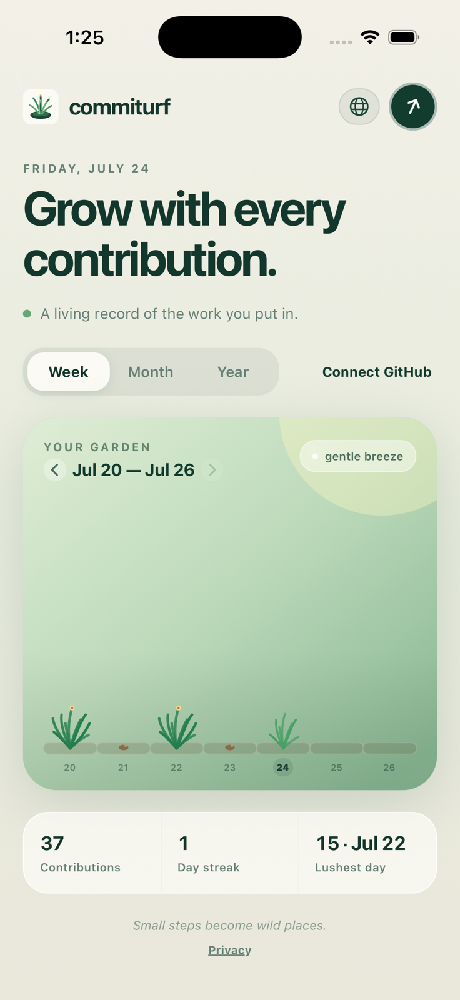
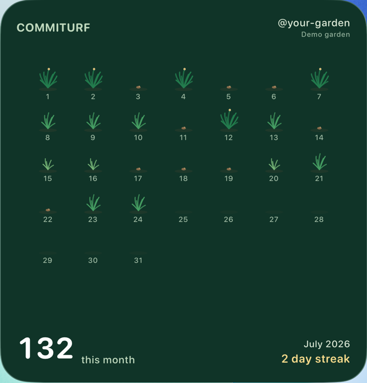

  

<h1 align="center">Commiturf</h1>

<strong>Your GitHub contributions, growing into a garden.</strong>

  
  

Commiturf turns the contribution activity on your GitHub account into a calm, living garden. Each day grows with your contribution intensity, from a seed to fully grown grass with a golden seed head.

## A garden that stays with you

- Explore your contributions by week, month, or year, including previous periods.
- Keep your garden visible with home screen widgets on iOS and Android. The large widget shows the full current month at a glance.
- Enjoy occasional gentle wind through the grass, with reduced-motion preferences respected.
- Use the app in English or Japanese.
- Revisit your latest synced garden while offline and refresh it when you reconnect.

## Connect securely with GitHub

Commiturf uses GitHub’s Device Flow and GraphQL API to load the contribution calendar GitHub exposes for the account you authorize. This includes public activity and any private contribution counts you have chosen to show on your GitHub profile. Authentication happens on GitHub, so Commiturf never sees your password.

The connection does not request access to private repositories, repository names, or repository contents. Contribution data is stored on your device for the app and widgets, while access and refresh tokens are kept in OS-backed secure storage. Commiturf does not use advertising, analytics, or its own account server. See the [Privacy Policy](docs/PRIVACY.md) for details.

## Availability

Commiturf is built for iOS and Android. App Store and Google Play links will be added here after release.

Commiturf is an independent app and is not affiliated with GitHub.
